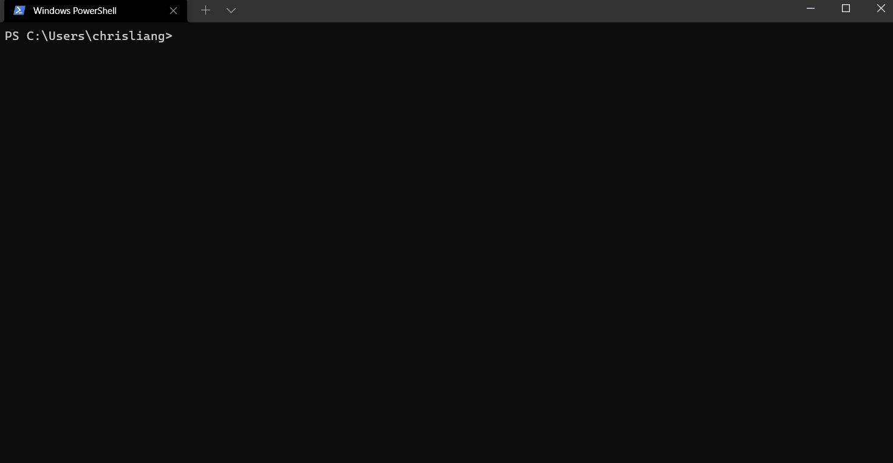

# <center>CHANGEDB</center>
ChangeDB is a muti-database convert cli tool, it's all about making database migration much more easier. 

<p align="center">

<a href="https://img.shields.io/nuget/v/ChangeDB.ConsoleApp">
    
</a>
<a href="https://github.com/yscorecore/changedb/blob/master/LICENSE">
    
</a>
<a href="https://codecov.io/gh/yscorecore/changedb">
    
</a>
</p>

## 📕 How to use


1. Install Dotnet (net5/net6). `ChangeDB` is supported by dotnet runtime, please check the link [Here](https://dotnet.microsoft.com/download/dotnet) to setup your personal dotnet runtime.
1. Install ChangeDB tool. you can follow the command below to setup tool quite easily.
   ```shell
   dotnet tool install ChangeDB.ConsoleApp -g
   ``` 
1. Database converting. you can use `changedb migration` command convert database. Like the example command below, you need to provide source database type, source database connection string, target database type and target database connection string to establish migrate task. and for target database, `changedb` tool has the ability to create a new target database even if not exists. so you don't create a empty database everytime first.
    ```shell
   changedb migration {source-database-type} "{source-connection-string}" {target-database-type} "{target-connection-string}" 
   ```
1. Dump database to sql scripts, `changedb` tool also has the ability to generate sql scripts. you can use `changedb dumpsql` command，Like the example example below to create sql scripts.
   ```shell
   changedb dumpsql {source-database-type} "{source-connection-string}" {target-database-type} "{output-file}" 
   ```
      Here is the demo for ChangeDB
   
## 🏗 Database Supported 

 - **Sql Server**
 - **Postgres**
 - **Sql Server Compact** (only supported in windows)

## Database Formate Connection String 

|Database | Format connection string  | Extend usages | 
|---|---|---|
|MS SQL| `Server=myServerAddress;Database=myDataBase;User Id=myUsername;Password=myPassword;` |[Link](https://www.connectionstrings.com/microsoft-data-sqlclient/) |
|Postgres| `Server=127.0.0.1;Port=5432;Database=myDataBase;User Id=myUsername;Password=myPassword;` |[Link](https://www.connectionstrings.com/npgsql/) |
|SQL CE| `Data Source=MyData.sdf;Persist Security Info=False;` |[Link](https://www.connectionstrings.com/sqlserverce-sqlceconnection/)|
    
## Database Object Supported
| Category | Object | Sql Server| Postgres| `Sql Server Compact` |
|---|---|---|---|---|
| Table|`identity`|✔️|✔️|✔️|
| Table|`index`|✔️|✔️|✔️|
| Table|`unique`|✔️|✔️|✔️|
| Table|`default constant value`|✔️|✔️|✔️|
| Table|`default function value`|✔️(`newid`,`getdate`)|✔️(`now`,`gen_random_uuid`)|✔️(`newid`,`getdate`)|
| Table|`foreign key`|✔️|✔️|✔️|
| Table|`unique index`|✔️|✔️|✔️|


